# 📬 Notifier — 알림 발송 시스템

## 1. 프로젝트 개요

수강 신청 완료, 결제 확정, 강의 시작 D-1, 취소 처리 등 다양한 비즈니스 이벤트 발생 시 사용자에게 **이메일(EMAIL)** 또는 **인앱(IN\_APP)** 알림 발송하는 시스템입니다.  알 채널을 확장할 수 있도록 설계했습니다.

**핵심 설계 목표**

* 네트워크 장애, 외부 서버 오류 등 알림 처리 실패가 비즈니스 트랜잭션에 영향을 주지 않는 **비동기 처리 구조**
* **알림 타입별 차등 재시도 정책**
* DB 유니크 인덱스와 멱등키 기반 낙관 락을 이용한 **중복 발송 방지**
* 서버 재시작 후에도 미처리 알림을 복구하는 **운영 안정성** 확보
* 공통 알람과 개인 알람의 메시지 발행 구분하여 OOM 방지

---

## 2. 기술 스택


| 구분          | 기술                                         |
| ------------- | -------------------------------------------- |
| **Language**  | Java 21                                      |
| **Framework** | Spring Boot 4.0.6                            |
| **ORM**       | Spring Data JPA / Hibernate                  |
| **DB**        | H2 (In-Memory)                               |
| **비동기**    | Spring`@Async`+`@TransactionalEventListener` |
| **재시도**    | Spring Retry                                 |
| **스케줄링**  | Spring`@Scheduled`                           |
| **분산 락**   | ShedLock                                     |
| **빌드**      | Gradle (Kotlin DSL), 멀티 모듈               |
| **기타**      | Lombok, Jackson, AOP Logging                 |

---

## 3. 실행 방법

### 사전 요구사항

* **JDK 21** 이상
* gradle 사용

### 빌드 및 실행

```bash
# 프로젝트 루트(Notifier)에서
./gradlew :app:bootRun --args='--spring.profiles.active=dev'
```

* 별도의 DB 설치 없이 H2 인메모리 DB로 즉시 실행 가능합니다.
* 기본 포트: `8080`
* H2 콘솔: `http://localhost:8080/h2-console` (JDBC URL: `jdbc:h2:mem:dev_db`)
* 서버 시작 시 Mock 유저 데이터가 자동 생성되며, 미처리 알림 복구가 자동 실행됩니다.

### 빌드만 수행

```bash
./gradlew clean build
```

---

## 4. 요구사항 해석 및 가정

> Spring Boot, JPA, DB 외의 외부 인프라는 사용할 수 없다고 가정

### 4.1 가정

#### (1) 유저

* 알림 채널은 **요청 파라미터가 아닌 유저의 구독 설정**에 따라 결정된다고 가정했습니다.
  * 유저가 이메일/인앱 모두 활성화했다면 **두 채널 모두**로 발송됩니다.
  * 유저가 해당 알림 타입 자체를 수신 거부한 경우 발송을 건너뜁니다.
* 서버 실행 시 임의의 mock User 데이터가 저장됩니다.
* 인증/인가는 subscriberId를 전달하는 방식으로 간략히 구현했습니다. 실제 환경에서는 JWT 등 토큰 기반 인증으로 대체되어야 합니다.

#### (2) DB

* DB 서버는 단일 인스턴스라고 가정했습니다.
* DB는 복합 유니크 인덱스를 사용할 수 있다고 가정했습니다.

#### (3) 알림 중요성 구분

* `공통 알림`은 상대적으로 중요도가 낮다고 가정했습니다.

#### (4) 알림 타입

* 알림 타입을 enum으로 고정해 놓았습니다.

#### (5) 예약

* 예약은 한 시간 단위(정각)로 한다고 가정했습니다.

### 4.2 요구사항 해석 및 설계 방향

#### (1) 알림 발송

* 대량 알림 발송 시 발생할 수 있는 데이터 팽창 및 메모리 과부하를 예방하기 위험이 존재했습니다.
* `공통 알림`과 `개인 알림`을 분리하여 설계했습니다.
* 발송 처리는 메인 비즈니스 로직에 영향을 주지 않도록 **비동기**로 진행합니다.

#### (2) 알림 상태 조회

* 발송 이력 추적과 사용자 제공용 데이터를 분리할 필요가 있다고 판단했습니다.
* 시스템에서 사용하는 **발송 시도 이력(NotificationLog)과**, 사용자에게 스냅샷 형태로 제공될 **알림 데이터(Notification)를 나누어 구성**했습니다.
* **알림 데이터(Notification)** 상태: `PENDING`(대기 중), `COMPLETED`(완료), `FAILED`(최종 실패)
* **발송 시도 이력(NotificationLog)** 상태: `REQUESTED`(요청됨), `PROCESSING`(처리 중), `SENT`(발송 완료), `RETRIED`(재시도 중), `FAILED`(최종 실패)
  * 최종 실패 시 **알림 데이터(Notification)** 에 실패 사유를 저장합니다.

#### (3) 읽음 처리

* 매체별 특성을 고려하여 읽음 처리 트리거를 다르게 해야했습니다.
* **App은 알림 클릭 시, E-mail은 메일 내 특정 버튼 클릭 시** 읽음 처리가 동작하도록 기획했습니다.
* 여러 기기(스마트폰, 태블릿, PC 등)에서 동일한 알림에 대해 동시에 읽음 처리 요청이 들어올 수 있는 동시성 상황을 고려하여 유니크 인덱스와 낙관 락으로 중복 처리를 방지했습니다.

#### (4) 알림 목록 조회

* `공통 알림`과 `개인 알림`을 통합하여 보여줄 필요가 있다고 생각했습니다.
* 종 모양 같은 아이콘 하나만 클릭하면 최신순으로 모든 소식을 볼 수 있어 사용자 경험이 매우 좋아질 것이라고 생각했습니다.
* 공통 알림과 개인 알림을 단일 쿼리로 통합하여 반환합니다.
* 페이징과 `읽음/안읽음` 필터링을 파라미터로 지원합니다.

#### (5) 중복 발송 방지

* 동시성 이슈를 제어하기 위해 **기본적으로 DB Lock을 적용하여 설계**했습니다.
* 추후 다중 인스턴스에서 사용된다면 분산락이나 메시지 브로커를 고려할 수 있습니다.
* 유니크 인덱스, @Version을 사용한 낙관 락, 멱등 키, ShedLock을 통해 동시성을 보장했습니다.

#### (6) 예약 발송

* 즉시성이 필수적인 개인 알림(예: 결제 완료)과 구분하여, 대량 발송 성격이 짙은 **공통 알림 기능에 한정하여 예약 발송을 적용**했습니다.
* 발송 예약 시각을 저장하고, 스케줄러가 주기적으로 조회하여 해당 시각이 도래한 항목을 처리합니다.

#### (7) 알림 템플릿 관리

* 알림 텍스트 형식의 잦은 변경에 대응하기 위해, **템플릿을 DB화하고 수정 히스토리를 관리**할 수 있도록 구성했습니다.
* 메시지 템플릿은 DB에 저장하여 관리합니다.
* admin 모듈에 템플릿 수정 API를 구현했습니다(인가 처리는 범위 외로 제외).

#### (8) 재시도 정책

* 알림의 비즈니스 중요도와 신속성 수준에 맞춰 **타입별 재시도 정책을 차등 적용**했습니다.
  * 즉시성이 중요한 '결제 완료' 알림과 상대적으로 여유가 있는 '신규 강의' 알림의 재시도 정책을 다르게 했습니다.
* 스케줄러가 주기적으로 임계 시간을 초과한 `PROCESSING` 상태 항목을 조회하여 재시도합니다.
* 다중 인스턴스 환경에서 스케줄러 간 경쟁은 낙관 락으로 방지합니다.
* 서버 재시작 시 미처리 알림을 조회하여 재처리합니다.

#### (9) 최종 실패 처리 및 수동 재시도

* `공통 알림`은 중요도가 낮다고 판단하여 최종 실패 사유는 저장하지 않으며, DB(DLQ 역할)에 저장하고 스케줄링을 통해 재시도합니다.
* 수동 재시도 시 복구 시도 여부를 데이터에 표시하고, 새로운 **로그 데이터(NotificationLog)** 를 생성하여 재시도 횟수를 초기화합니다.

---

## 5. 설계 결정과 이유

### (1) 확장에 열려있는 멀티 모듈 구조

* **인프라 변경에 유연한 대처**:
  * 향후 메시지 브로커 시스템이나 알림 채널(이메일, 인앱 외 카카오톡 등)의 확장이 빈번할 것으로 예상하여 모듈을 분리했습니다.
* **도메인 중심 설계**:
  * 외부 기술이 비즈니스 로직을 오염시키지 않도록 의존성이 항상 도메인(`core`) 방향을 향하게 설계했습니다.
* **Port & Adapter 패턴 적용**:
  * `core` 모듈에는 인터페이스만 정의하고, 실제 기술 구현은 `infrastructure` 모듈(Adapter)이 담당합니다.
* **비즈니스 로직 보호**:
  * 이를 통해 기존 RDB 기반 브로커를 Kafka로 교체해야 할 때, 핵심 로직은 단 한 줄도 건드리지 않고 `infrastructure:message-broker:rdb` 모듈을 `kafka` 모듈로 교체하기만 하면 됩니다.

```css
Notifier/
├── app                          # 실행 모듈 (미처리 알림 복구 Runner)
├── api                          # REST API 컨트롤러
├── admin                        # Admin API (메시지 템플릿 관리)
├── core                         # 도메인 모델, 서비스, 포트(인/아웃) 정의
├── infrastructure/
│   ├── persistence/jpa          # JPA 엔티티, Repository, Adapter
│   ├── notifier/
│   │   ├── (공통)              # AbstractNotifierAdapter, TemplateRendererAdapter
│   │   ├── email                # 이메일 발송 어댑터 (Mock)
│   │   └── in_app               # 인앱 발송 어댑터 (Mock)
│   ├── message-broker/
│   │   ├── (공통)                # NotificationDispatcher, NotifierFacade
│   │   └── rdb                  # RDB 기반 이벤트 발행, 재시도 처리
│   └── scheduler/spring         # 스케줄러 (Stuck 복구, 예약 발송, DLQ 복구)
└── support/logging              # 로깅
```

### (2) 알림 데이터의 목적별 엔티티 분리 설계

하나의 테이블에서 알림 데이터와 발송 이력을 모두 관리할 경우 발생하는 **DB 쓰기 병목 현상과 상태 관리의 복잡성을 해결하기 위해**, 데이터의 목적과 생명 주기에 따라 엔티티를 3가지(`Notification`, `PublicNotification`, `NotificationLog`)로 분리 설계했습니다.


| 모델                 | 설명                                                         |
| -------------------- | ------------------------------------------------------------ |
| `Notification`       | 사용자에게 보여지는 알림 자체 (읽음/안읽음, 상태 등)         |
| `NotificationLog`    | 발행 시도에 대한 이벤트 로그 (요청, 재시도, 성공, 실패 기록) |
| `PublicNotification` | 다수에게 발송되는 공지/이벤트 알림(신규 강의, 공지 사항 등)  |

**공용 알림(`PublicNotification`) 분리: 대량 발송 쓰기(Write) 부하 해결**

* **설계 이유**:
  * 전체 가입자(또는 불특정 다수)에게 신규 강의나 공지사항을 발송할 때, 가입자 수백만 명의 개인 테이블(`Notification`)에 동일한 알림 데이터를 일일이 생성하면 심각한 DB 쓰기 부하와 디스크 공간 낭비가 발생한다고 생각했습니다.
* **구현**:
  * 다수에게 발송되는 공통 알림은 `PublicNotification` 테이블에 **단 1건만 저장**하고, 사용자가 알림함을 조회하는 시점에 개인 알림과 결합하여 보여주도록 설계했습니다.
  * 이를 통해 DB 쓰기 부하를 획기적으로 줄이고 발송 성능을 최적화했습니다.

**`Notification`과 `NotificationLog`의 분리 (이력 및 재시도 관리)**

* **설계 이유**:
  * 알림 전송 과정에서 네트워크 오류나 외부 벤더사 장애로 인해 전송이 실패할 경우, '성공/실패' 상태만 덮어쓰게 되면 **언제, 왜, 몇 번 실패했는지에 대한 히스토리**를 추적할 수 없습니다.
* **구현**:
  * 사용자에게 보여지는 '알림의 원형(`Notification`)'과 시스템 내부의 '발송 시도 이력(`NotificationLog`)'을 물리적으로 분리했습니다.
  * 이를 통해 알림별 요청, 실패 사유, 재시도(Retry) 횟수, 성공 여부를 독립적인 이벤트 로그로 기록하여 **명확한 상태 추적과 견고한 재시도 정책 수립**이 가능해졌습니다.

### (3) 개인 알림과 공개 알림 분리 설계

대량 알림 발송 시 발생할 수 있는 데이터 팽창 및 메모리 과부하를 예방하기 위험이 존재했기 때문에
`공통 알림`과 `개인 알림`을 분리하여 설계했습니다.

**발송 대상 및 목적 (도메인 관점)**


| 구분                     | 설명                                                               |
| ------------------------ | ------------------------------------------------------------------ |
| **개인 알림 (Personal)** | 특정 수신자 1명에게 발송하는 알림 (결제 완료, 취소 처리 등)        |
| **공개 알림 (Public)**   | 해당 타입을 구독한 전체 사용자에게 발송하는 알림 (새 강의 오픈 등) |

**읽음 처리 방식**

* **개인 알림**
  * `notifications` 테이블 내에 존재하는 `is_read` (boolean) 컬럼을 `true`로 업데이트하여 읽음 처리를 단순하게 완료합니다.
* **공통 알림**
  * 원본 데이터가 1건뿐이라 원본 테이블에 개개인의 읽음 여부를 마킹할 수 없습니다.
  * 따라서 \*\*`public_notification_receipts`이라는 별도의 매핑 테이블을 사용하여, 어떤 사용자(`subscriberId`)가 어떤 공통 알림(`publicNotificationId`)을 언제(`readAt`) 읽었는지를 N:M(구조상 1:N) 형태로 따로 기록하여 읽음 상태를 관리합니다.

**발송 로직 설계**

* **개인 알림**
  * **DB 적재:**
    * 알림 생성 시, 수신자(`subscriber_id`)와 채널(`channel`) 정보가 확정된 상태이므로 `Notification` 엔티티를 생성하여 `notifications` 테이블에 직접 저장합니다.
  * **로그 적재:**
    * 발송 추적을 위해 **`NotificationLog`를 PENDING 상태로 함께 저장**(`saveAll(notificationLogs)`)합니다.
  * **이벤트 발행:**
    * 트랜잭션 커밋 완료 후(`AFTER_COMMIT`), 저장된 1건의 알림 데이터를 기반으로 `NotificationRequestedEventHandler`가 1개의 `PublishCommandEvent`를 발행합니다.
      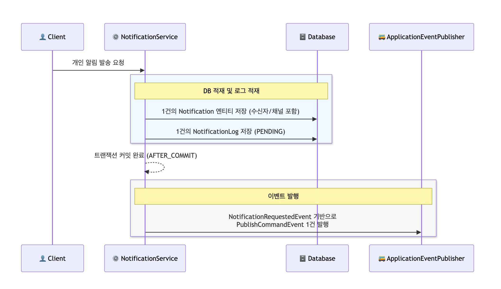
* **공통 알림**
  * **DB 적재:**
    * 수신자나 채널 정보 없이 알림의 원본 내용만 담긴 `PublicNotification` 엔티티 **단 1건**을 `public_notifications` 테이블에 저장합니다.
  * **대상자 분리 및 로그 적재:** \`
    * PublicNotificationBulkProcessor`가 전체 구독자(`subscriberIds`)를 순회하며 개개인이 켜둔 알림 채널을 조회합니다. 그 후 각 유저/채널 단위로 무수히 많은 **`NotificationLog\`를 PENDING 상태로 선적재\*\*합니다.
  * **대량 이벤트 쪼개기:**
    * 각 유저/채널별로 `PublishCommandEvent.toPublic()`을 개별 생성하여 **이벤트를 쪼개어 발행**합니다.
  * **안전망 (DLQ):**
    * 이 대량 발행 및 분배 과정 중 서버 에러가 나면, 해당 요청 원본은 `public_notification_dlq` 테이블에 격리(Dead Letter Queue)되어 스케줄러를 통해 나중에 복구됩니다.
      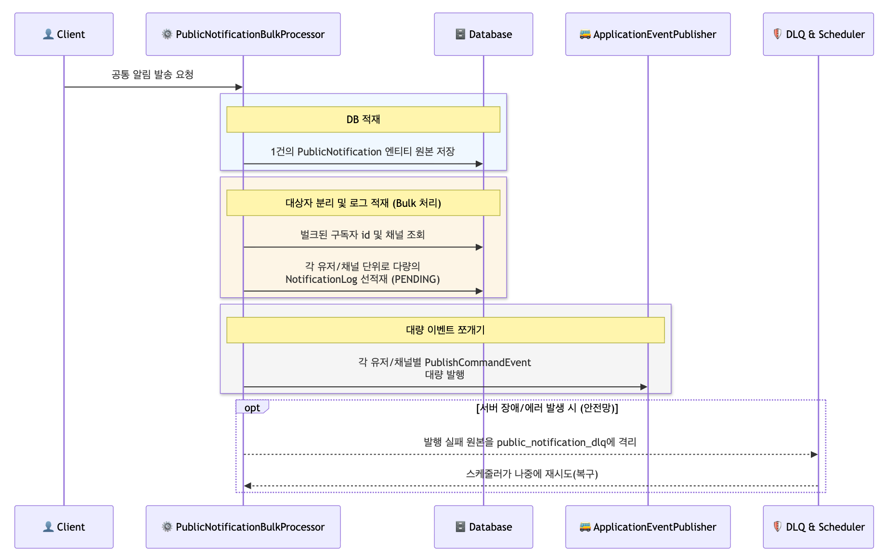
* **공통 로직**
  개인 알림이 쏜 1건의 이벤트든, 공통 알림이 쪼개서 쏜 수만 건의 이벤트든 **메시지 버스(Event Bus)에 도달한 직후부터는 둘의 구분이 사라집니다.** 완전히 동일한 파이프라인을 탑니다.
  * **수신 및 격리:**
    * `RdsNotificationEventPublishAdapter`가 `PublishCommandEvent`를 수신하여 비동기 스레드 풀 위에서 동작합니다.
  * **중복 발송 차단:**
    * `notificationLogUseCase.tryClaim()`을 호출해 방금 전 단계들에서 저장해 둔 `NotificationLog`에 낙관적 락을 잡고 상태를 `PROCESSING`으로 변경합니다. 다른 스레드가 먼저 채갔다면 락 예외를 내고 즉시 발송을 포기합니다.
  * **채널 라우팅 (Dispatch):**
    * 이벤트에 적힌 채널 문자열(예: EMAIL, IN\_APP)을 보고 `NotifierFacade`가 알맞은 발송 어댑터(`NotifierPort`)를 찾아 `NotificationDispatcher`에게 던져줍니다.
  * **외부 발송 및 실패 처리 (Retry):**
    * 실제 네트워크 망으로 발송을 시도(`publish`)하며, 성공하면 `COMPLETED`이벤트 발행(`PublishCompletedEvent`)
      * 실패하면 `RetryProcessor`가 개입하여 알림 성격(NotificationType)에 따른 백오프(Backoff) 전략으로 재시도를 돌립니다.
        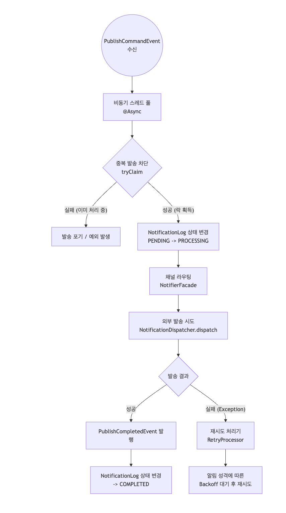

### (4) 재시도 정책(Retry Policy) 차등 적용 및 추상화

* 알림 발송 실패 시 일괄적인 재시도를 수행할 경우, **불필요한 시스템 리소스 낭비와 외부 벤더사(API)에 대한 부하(장애 전파)** 가 발생할 수 있습니다.
* 이를 해결하기 위해 알림의 비즈니스 중요도에 따라 재시도 수준을 3단계로 차등 적용하고, 유연한 확장을 위한 객체지향적 설계를 도입했습니다.
  **비즈니스 임팩트를 고려한 재시도 수준(Level) 차등화**
* **금전/결제 알림(Aggressive)** : 유저의 금전과 직결된 이벤트는 서비스 신뢰도와 직결된다고 생각하여, 가장 공격적인 재시도 정책을 적용하여 알림 유실을 원천 차단했습니다.
* **마케팅/공지 알림(Minimum)**: 단순 브로드캐스트 알림은 실패가 비즈니스에 미치는 타격이 상대적으로 적으므로(상황에 따라 다를 수 있음), 불필요한 시스템 부하를 막기 위해 최소한의 재시도만 허용하도록 리소스를 최적화했습니다.


| 레벨           | 대상 알림 타입                               | 최대 재시도 | 백오프                | 최대 대기 |
| -------------- | -------------------------------------------- | ----------- | --------------------- | --------- |
| **AGGRESSIVE** | `PAYMENT_CONFIRMED`,`CANCELLATION_PROCESSED` | 8회         | 1초 × 3.715배 (지수) | 1시간     |
| **STANDARD**   | `COUPON_ISSUED`,`COUPON_EXPIRY_REMINDER`     | 3회         | 1초 × 2배 (지수)     | 10초      |
| **MINIMUM**    | `COURSE_START_REMINDER`,`NEW_LECTURE_OPENED` | 2회         | 1초 × 2배 (지수)     | 5초       |

**확장성을 고려한 구현**
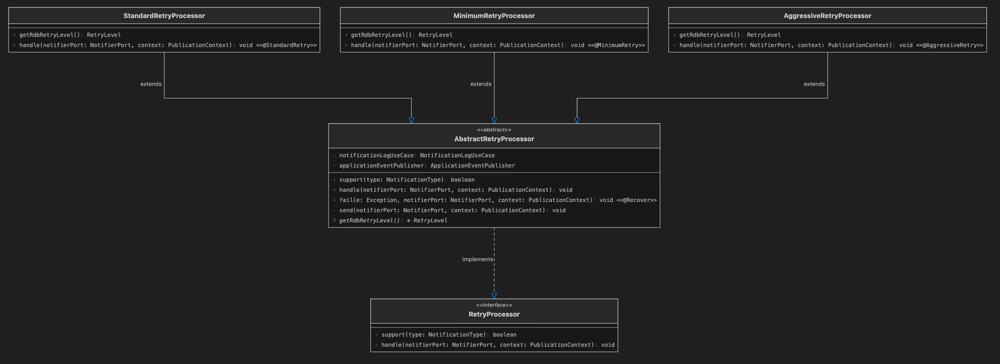

* **동적 라우팅 (전략 패턴 & 템플릿 메서드)**
  * 알림 타입에 맞는 재시도 객체를 런타임에 탐색하여 위임(전략 패턴)했습니다.
  * 횟수 추적 및 로깅 등 반복되는 공통 흐름은 추상 클래스(`AbstractRetryProcessor`)에 위임하여 OCP를 준수했습니다.
* **선언적 커스텀 어노테이션 도입**
  * 복잡한 Spring Retry 설정을 비즈니스 로직에 하드코딩하지 않았습니다.
  * 자식 클래스에 `@AggressiveRetry`, `@MinimumRetry` 등 추상화된 커스텀 메타 어노테이션만 부여하여 재시도 정책이 주입되도록 구현했습니다.
* **운영 안정성을 위한 재시도 튜닝 (지수 백오프 & 설정 외부화)**
  * 고정된 간격이 아닌 `multiplier`를 적용한 지수 백오프를 설계하여 외부 시스템의 부하를 방지했습니다.
  * 재시도 횟수와 딜레이 시간을 `application.yml` 프로퍼티로 주입받아 재시도 전략이 바뀔 시에도  관리를 용이하게 했습니다.
* **최종 실패 시 실패 내용 저장**
  * 최종 실패 시 최종 실패 이벤트를 발행하여 Notification에 상태를 변경합니다.

### (5) 알림 상태 전이 모델링

발송 주체와 목적에 따라 상태 전이 기준을 다르게 가져가며, 상태를 추적합니다.

**Notification (개인 알림)**

* 사용자에게 전달되는 상태입니다.

```text
PENDING → COMPLETED   (개별 발송 성공)
PENDING → FAILED      (최종 실패)
FAILED  → PENDING     (수동 재시도로 복구)
```

**PublicNotification (공통 알림)**

* 1000명 중 100개가 실패했다고 해서 FAILED 처리를 하면 안되므로, 발송 실패 시 실패 데이터 저장 후 스케줄링으로 재시도합니다.

```text
PENDING → COMPLETED   (전체 대상 브로드캐스트 및 데이터 등록 성공)
```

**NotificationLog (발송 및 재시도 이력)**

* 알림 본체의 상태와 별도로, 개별 발송 **'시도(Attempt)'** 자체의 상태를 기록하여 재시도 정책과 로깅에 활용합니다.
* 시스템에서 상태를 구별하는데 사용됩니다.

```text
REQUESTED → PROCESSING   (발송 처리 시작)
PROCESSING → SENT        (발송 성공)
PROCESSING → RETRIED     (재시도 발생)
PROCESSING → FAILED      (최종 실패 또는 타임아웃)
```

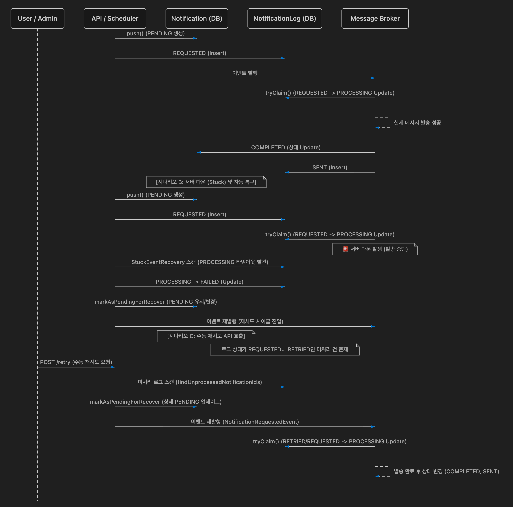

### (6) 다중 인스턴스/다중 스레드와 반복 요청에서 중복 발송 방지 설계

* 다중 인스턴스나 다중 스레드 상황에서 반복 요청의 가능성이 존재했습니다.
* 데이터가 DB에 저장되고 상태에 따라 알림을 발송하기 때문에 유니크 제약, 낙관적 락, 멱등 키, ShedLock을 사용해 데이터 중복 저장을 방지했습니다.
* 다른 외부 인프라는 도입하지 않았습니다.

**유니크 인덱스를 사용해 중복 저장 방지**

* **개인 알람(NotificationEntity)**:
  * 동일한 사용자에게 같은 타입(예: 결제 완료)의 알림 요청이 중복으로 유입될 수 있는 상황을 고려했습니다.
  * 이를 방지하기 위해 요청 메타데이터를 기반으로 한 **멱등성 키(`idempotency_key`)를** 도입하고, `[subscriber_id, notification_type, channel, idempotency_key]` 조합으로 유니크 인덱스를 설정하여 알림의 중복 생성을 원천 차단했습니다.
* **로그 데이터(NotificationLogEntity)**:
  * 이벤트 발행 및 발송 처리 과정에서 중복 로그가 적재되는 것을 막기 위해 `[reference_id, reference_type, channel_type, subscriber_id]` 같은 식별 데이터뿐만 아니라 **이벤트 상태(`event_status`)와 재시도 카운트(`retry_count`)까지** 유니크 인덱스에 포함시켜, 상태 변화 및 재시도 단계별로 정확히 1건의 로그만 기록되도록 무결성을 보장했습니다.

```java
//NotificationEntity.class
uniqueConstraints = {
	@UniqueConstraint(
		name = "uk_notification_idempotency",
		columnNames = {
			"subscriber_id", 
			"notification_type", 
			"channel", 
			"idempotency_key"
		}
	)
}

//NotificationLogEntity.class
uniqueConstraints = {
	@UniqueConstraint(
		name = "uk_notification_logs_duplicate",
		columnNames = {
			"reference_id", 
			"reference_type", 
			"channel_type", 
			"subscriber_id", 
			"event_status", 
			"retry_count"
		}
	)
}
```

**낙관적 락(Optimistic Lock)을 사용한 중복 발행 방지**

* **문제 해결:**
  * 다중 인스턴스 혹은 멀티스레드 환경에서 발생할 수 있는 '동시 발송(데이터 경합)' 문제를 해결하기 위해 엔티티에 `@Version`(Long 타입) 기반의 낙관적 락을 도입했습니다.
* **구현 상세**:
  * 메시지 발송 직전에 `tryClaim` 메서드를 통해 `NotificationLogEntity`의 상태를 검증합니다. 현재 상태가 `REQUESTED`(요청됨) 또는 `RETRIED`(재시도됨)인 경우에만 `PROCESSING`(처리 중) 상태로 변경을 시도하며, 상태 변경(Lock 획득)에 성공한 단일 스레드만 실제 발송 로직을 수행하도록 구현하여 중복 발행을 원천 차단했습니다.

**ShedLock을 활용한 스케줄러 분산 락 적용**

* **문제점**:
  * 스케일 아웃된 다중 서버 환경에서 배치/스케줄러(예: 실패 알림 재시도 로직)가 동시에 실행될 경우, 동일한 작업이 중복으로 처리될 위험이 있었습니다.
* **해결**:
  * `ShedLock`을 도입하여 스케줄러 실행 시 DB 기반의 분산 락을 획득하도록 구성했습니다. 이를 통해 여러 인스턴스가 동시에 띄워져 있더라도 오직 하나의 인스턴스만 복구/재시도 로직을 수행하도록 제어하여 중복 처리를 원천 차단했습니다.
  * 인스턴스 최초 기동 시 빈 락(Lock) 테이블에 여러 서버가 동시에 `INSERT`를 시도하여 발생하는 경합 에러를 막기 위해 `ShedlockDataRunner(ApplicationRunner)`를 도입했습니다.
  * 서버 시작 시 락 만료 시간(`lockUntil`)을 '과거 시간'으로 세팅한 더미 데이터를 삽입해 두어, 스케줄러가 즉시 안전하게 `UPDATE` 락을 획득하고 미처리 알림을 유실률 0%로 빠르게 복구할 수 있도록 견고하게 설계했습니다.

### (7) 진행 중인 프로세스가 장기 지속(Stuck) 상태일 경우의 복구

알림 발송 중(`PROCESSING`) 서버 다운이나 외부 벤더사 API 지연이 발생할 경우, 상태가 영원히 멈추어 알림이 누락되는 문제가 발생할 수 있습니다. 이를 방지하기 위해 **5분 단위로 동작하는 `StuckEventRecoveryScheduler`를 도입**하여 주기적으로 시스템 내의 미처리(Stuck) 상태를 모니터링하도록 구축했습니다.

* 5분 주기로 스케쥴링을 설정한 이유
  * 재시도 전략 중 **STANDARD와 MINIMUM 정책은 모든 재시도가 최대 3분 이내에 완전히 종료**되도록 설계했습니다. 즉, 3분이 지난 후에도 상태가 `PROCESSING`에 머물러 있다면 이는 명백한 'Stuck' 상태로 확정 지을 수 있습니다.
  * 따라서 오탐지없이 확실히 멈춘 이벤트만 타겟팅하기 위해 3분보다 조금 더 넉넉한 **5분**을 스캔 주기로 설정했습니다.
  * 동시에, 최대 재시도 시간이 1시간인 **AGGRESSIVE** 정책의 경우에도 5분 주기로 빠르게 복구해 주면 알림 지연을 최소화하며 재시도 파이프라인에 다시 태울 수 있어 전체적인 밸런스가 가장 적절하다고 판단했습니다.

**재시도 수준별(RetryLevel) 차등 임계시간(Threshold) 적용**

* 알림의 중요도에 따라 재시도 전략(Aggressive, Standard, Minimum)이 다르기 때문에, `StuckEventRecoveryScheduler`가 복구 대상을 스캔할 때 일괄적인 시간을 적용하지 않았습니다.
* 각 전략별로 설정된 `MaxProcessingTime` 설정값을 외부(`application.yml`)에서 주입받아, 현재 시간에서 해당 임계시간을 뺀 `thresholdTime`을 동적으로 계산하여 복구 대상을 정밀하게 타겟팅했습니다.

**복구 처리**

* 발견된 Stuck 이벤트는 "Stuck Timeout Recovery"라는 명확한 실패 사유와 함께 `FAILED` 상태로 마킹하여 다음 스케줄링때 조회되지 않도록 했습니다.
* 그 후, 내부 재시도 로직(`retryStuckNotification`)을 태워 시스템이 스스로 원활하게 복구하도록 설계했습니다.

### (8) 서버 재시작 후 미처리 알림 방어

서버가 중단되거나 재시작될 경우 발송되지 못한 미처리 알림들이 유실될 가능성이 있습니다.
이를 방지하기 위해, 서버 기동 직후 스케줄러가 누락된 알림을 벌크로 읽어와 재발행(`retry`)하도록 구성했습니다.

**ShedLock 분산 락을 통한 중복 복구 차단**

* 서버 기동 직후 스케줄러가 누락된 알림을 벌크로 읽어와 재발행(`retry`)하도록 구성했습니다.
* 다중 서버(Scale-out) 환경에서 여러 인스턴스가 동시에 재시작될 경우, 모든 인스턴스가 미처리 데이터를 스캔하여 동일한 알림을 여러 번 중복 발송하는 상황이 발생할 수 있습니다.
* **DB 기반의 `ShedLock`을 결합**하여, 여러 서버 중 단 한 대의 인스턴스만 복구 스케줄러의 락(Lock)을 획득해 오직 1회만 재발송을 수행하도록 제어했습니다.

**대용량 미처리 데이터를 대비한 청크(Chunk) 처리**

* 서버 재시작 시 미처리 알림 데이터가 수십만 건 이상 대량으로 쌓여 있을 수 있음을 고려하여, 한 번에 메모리에 올리지 않았습니다.
* `lastId` 기반의 No-Offset 쿼리와 **청크(Chunk) 단위 분할 처리 로직**을 적용해 OOM(Out Of Memory)을 방지하고 DB 스캔 부하를 최적화했습니다.

### (9) 수동 재시도 API를 통한 실패 및 미처리 알림 통합 복구 설계

시스템 장애나 일시적인 네트워크 오류 등으로 인해 알림 발송이 명시적으로 실패하거나 처리 도중 중단될 수 있습니다. 이러한 유실을 방지하기 위해, 수동 재시도 API(`POST /v1/notifications/retry`)가 단순 실패(`FAIL`) 건뿐만 아니라 처리 도중 멈춰버린 미처리(`PENDING`) 건들까지 포괄하여 재발행(`retry`)하도록 구성했습니다.

**실패 및 미처리 상태의 통합 재발행**

* 정상적으로 완료(`COMPLETED`)되지 못하고 사각지대에 놓인 모든 이벤트를 스캔 대상으로 삼았습니다.
* 에러로 인해 상태가 `FAILED`로 변경된 알림뿐만 아니라, 시스템 셧다운이나 타임아웃으로 인해 멈춰버린 `PENDING` 상태의 알림들(로그 기준 `REQUESTED`, `RETRIED`)도 모두 재시도 대상으로 간주하여 이벤트를 다시 발송합니다.
* 내부 로직을 통해 상태를 PENDING으로 변경 후 이미 완료된 건의 중복 처리를 방어했습니다.
* 낙관적 락을 통해 중복 재발행을 방지했습니다.

### (10) 발송 예약 설계

대량 발송 성격이 짙은 **공통 알림 기능에 한정하여 예약 발송을 적용**했습니다. 발송 예약 시간은 매 시간 정각 단위로 설정하도록 설계했습니다.

**특정 시점 발송 파이프라인 분리**:

* 예약 알림 전용 데이터(`ReservationNotificationEntity`)를 별도로 분리하고, `ReservationNotificationScheduler`가 주기적으로 현재 시간과 비교해 발송 시점이 도달한 예약 건만 발행하도록 아키텍처를 분리했습니다.

### (11) 다중 기기에서의 동시 읽음 처리 방어

**개인 발송**

* 애플리케이션 메모리에 엔티티를 불러와서 상태를 변경(Read-Modify-Write)하지 않고, DB에 직접 `UPDATE` 쿼리를 날리도록 구현하여 애플리케이션 레벨의 동시성 문제를 원천 차단했습니다.
* `WHERE n.isRead = false` 조건을 쿼리에 명시하여, 단 한 번의 요청만 실제 업데이트를 수행하고 나머지 중복 요청은 데이터베이스의 행 수준 잠금(Row-level Lock)에 의해 안전하게 무시되도록 멱등성을 보장했습니다.
* 불필요한 엔티티 단건 조회나 낙관적 락 충돌에 따른 예외 처리 비용 없이 동시 요청을 방어했습니다.

**공통 발송**

* 공통 알림의 특성상 엔티티를 수정하는 대신 `public_notification_receipts` 테이블에 사용자의 수신/읽음 내역(Receipt)을 새로 추가하는 방식을 사용합니다.
* 중복 처리를 방어하기 위해 DB 스키마에 `subscriber_id`와 `public_notification_id`를 묶은 **복합 유니크 제약조건**을 명시했습니다.
* 따라서 찰나의 순간에 여러 기기에서 동시에 요청이 들어오더라도, 첫 번째 요청만 정상적으로 Insert 되고 나머지 중복 요청들은 데이터베이스 레벨의 유니크 인덱스 충돌에 의해 원천 차단되므로 데이터 정합성이 보장됩니다.
* 또한 불필요한 DB 예외 발생과 트랜잭션 롤백 비용을 최소화하기 위해, Insert 직전 `existsReceipt`로 사전 검증(Fast-fail)을 수행하는 최적화 로직도 함께 구성했습니다.

### (12) 동적 알림 템플릿 관리 및 렌더링 시스템 설계

하드코딩된 메시지를 전송할 경우, 마케팅 문구 변경이나 오타 수정 시마다 서버를 재배포해야 하는 문제가 발생할 수 있습니다. 이를 방지하기 위해 **DB 기반의 `MessageTemplate`을 도입**하여 알림 발송 직전에 동적으로 메시지를 조합하고 렌더링하도록 구축했습니다.

**백오피스(Admin) 연동 및 실시간 반영**

* admin 모듈에서 수행합니다.
* 소스 코드 수정 없이 백오피스 환경에서 운영자가 직접 템플릿 내용을 관리(CRUD)할 수 있도록 관리의 유연성을 확보했습니다.
* 알림 발송 시 `TemplateRendererAdapter`가 DB에 저장된 활성 템플릿을 최우선으로 스캔하여, 운영자의 변경 사항이 즉각적으로 반영되도록 설계했습니다.

**안전한 폴백(Fallback) 방어 메커니즘**

* DB 기반 조회의 가장 큰 약점은 간헐적인 DB 장애(타임아웃 등) 발생 시 알림 발송 시스템 전체가 마비될 수 있다는 점입니다.
* 이를 방어하기 위해 DB에서 템플릿을 찾지 못하거나 예외가 발생할 경우, \*\*클래스패스 내장 정적 파일을 로드하도록 2단계 폴백(Fallback) 방어 코드를 적용했습니다.
* 예외를 던지고 발송을 포기하는 대신 내장 템플릿으로 안전하게 우회하도록 처리함으로써, 외부 장애 요인에도 알림 발송이 결코 실패하지 않도록 가용성을 확보했습니다.

**변수 동적 치환 및 공통 레이아웃(Base Layout) 결합**

* 템플릿 본문 내의 `{name}`, `{amount}` 등의 예약어를 발송 요청 시 전달받은 `metadata`와 매핑하여, 발송 직전에 완벽하게 개인화된 메시지로 치환합니다.
* 또한 채널별(Email, In-App 등)로 공통적으로 들어가는 헤더, 푸터, HTML 스타일링 코드를 개별 템플릿마다 중복 작성하지 않도록 개선했습니다.
* 공통 베이스 레이아웃(`email-base.html` )을 선행 로드한 뒤, `{body_content}` 영역에 렌더링된 본문을 주입하는 조립식 구조를 사용하여 코드의 중복을 제거하고 유지보수성을 극대화했습니다.
  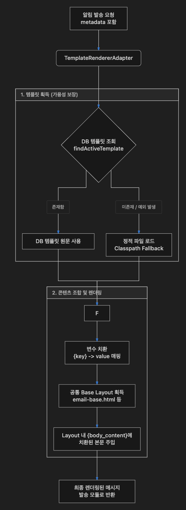

---

## 6. 비동기 처리 구조

현 시스템은 내부 시스템 리소스 보호와 외부 벤더에 의존하지 않는 응답 처리를 위해 비동기 처리가 필요합니다.

* 시스템에서 비동기 처리는 Spring의 기능인 `ApplicationEventPublisher`와 AOP의 `@Async` 기능을 활용하였습니다.
* 외부 벤더와 관련한 비동기 처리는 `가상 스레드`를 사용했습니다.
* 스케쥴링과 관련된 스레드는 따로 스레드 풀을 설정하였습니다.

### 비동기 처리에 가상 스레드(Virtual Thread)를 사용이유

외부 API(이메일 발송, 앱 푸시 등)를 호출하는 작업은 대표적인 **I/O Bound 작업**이라고 생각합니다.
기존의 일반적인 스레드 풀을 사용하면 다음과 같은 문제가 발생할 수 있습니다.

* **스레드 고갈 (Thread Exhaustion):** 외부 API의 응답이 지연될 경우, 스레드가 멈춰서 Block이 되어 가용 스레드가 순식간에 고갈될 수 있습니다.
* **오버헤드:** OS 스레드를 수만 개씩 생성하는 것은 메모리 비용이 매우 비싸고 컨텍스트 스위칭 오버헤드가 큽니다.

하지만 **가상 스레드**를 도입으로 이러한 문제를 해결 가능합니다.

1. **다량의 스레드 생성:** 수만 건의 `PublishCommandEvent`가 동시에 발생해도, OS 스레드에 의존하지 않고 JVM 단에서 가벼운 가상 스레드를 수만 개 즉시 생성하여 각각 할당할 수 있습니다.
2. **블로킹(Blocking) 비용 감소:** 가상 스레드가 외부 API 응답을 기다리며 대기(Block) 상태에 빠질 때, 기반이 되는 캐리어 스레드(OS 스레드)는 멈추지 않고 즉시 다른 가상 스레드의 작업을 처리하러 넘어갑니다.

### 개인 알림 비동기 처리 흐름


개인 알림은 단일 수신자를 대상으로 하며, 비교적 단순한 `1단계 비동기 전환`을 거칩니다.

#### 단계별 흐름

1. **`NotificationService` (동기 - Sync)**
   * **동일 트랜잭션 내 처리:** 클라이언트의 요청을 받아 `Notification`(알림 본체)과 `NotificationLog`(알림 로그)를 DB에 저장합니다.
   * 데이터가 안전하게 저장된 직후, `NotificationRequestedEvent`를 발행합니다.
2. **이벤트 발행 (`ApplicationEventPublisher`)**
   * 이벤트를 비동기(Async) 큐로 전달하여 클라이언트 요청 쓰레드는 즉시 응답을 반환합니다.
3. **`Async Handler` (비동기 - Async)**
   * 비동기 쓰레드 풀에서 이벤트를 수신합니다.
   * 실제 발송을 위한 `PublishCommandEvent`를 생성하여 `Notifier` 컴포넌트로 전달합니다.
   * `Notifier`가 외부 API(이메일, 앱 푸시 등)를 호출하여 유저에게 최종 발송합니다.

### 공통 알림 비동기 처리 흐름 (Public Notification)

공통 알림은 다수의 대상자에게 알림을 보내야 하므로, `2단계의 비동기 전환`을 통해 부하를 분산합니다.

* **Chunk 분할 조회:**
  * 메모리 부족(OOM)을 방지하기 위해 대상자를 한 번에 조회하지 않고 끊어서 조회합니다.
* **DB Insert와 외부 API 호출의 분리:**
  * 대량의 로그를 DB에 적재하는 작업(`BulkProcessor`)과, 실제로 외부 API를 호출하는 작업(`Async Handler`)을 두 번의 비동기 이벤트로 분리했습니다.
  * DB 트랜잭션을 짧게 유지하면서 네트워크 I/O 병목을 독립적으로 처리할 수 있습니다.

#### 단계별 흐름

1. **`PublicNotificationService` (동기 - Sync)**
   * **동일 트랜잭션 내 처리:** 해당 알림을 수신해야 하는 대상자(`subscriberIds`)를 Chunk 단위로 쪼개어 조회합니다.
   * 쪼개진 단위별로 다수의 `PublicNotificationRequestedEvent`를 발행합니다.
2. **1차 이벤트 발행 (`ApplicationEventPublisher`)**
   * 대량의 이벤트를 비동기로 발행하여, 최초 요청을 보낸 관리자/시스템 쓰레드를 즉시 응답을 반환합니다.
3. **`PublicNotificationBulkProcessor` (비동기 - Async)**
   * 비동기로 동작하는 벌크 프로세서가 이벤트를 수신합니다.
   * **동일 트랜잭션 내 처리:**
     * `PublicNotification` (공통 알림 원본 - 단건) 저장
     * `NotificationLog` (수신자별 발송 로그 - 다수) 저장
   * 처리가 끝난 로그들에 대해 개별 발송을 지시하는 `PublishCommandEvent`를 발행합니다.
4. **2차 이벤트 발행 (`ApplicationEventPublisher`)**
   * 개별 발송 이벤트 수만 건이 다시 비동기 큐에 적재됩니다.
5. **`Async Handler` (비동기 - Async)**
   * 개인 알림과 동일한 최종 발송 핸들러가 수만 건의 이벤트를 병렬로 소비하며 유저에게 알림을 발송합니다.

---

## 7. 미구현 / 제약사항/개선할 점

* **모니터링 제약**
  * 에러 로그가 생겼을때, 모니터링을 하거나 알림을 보내는 인프라가 없습니다.
* **인증/인가 미구현**:
  * 사용자 식별은 `subscriberId`를 요청 파라미터/바디로 전달하는 방식을 사용합니다.
* **대량 공개 알림 제약**:
  * Chunk 기반 처리를 하고 있으나, 수십만 건 이상의 대량 발송 시에는 DB 보다 실제 메시지 브로커 도입이 필요합니다.
* **예약 관련 제약**:
  * 현재는 발송 예약은 정각에만 할 수 있습니다. 정확한 발송 시간을 지정하고 싶다면 `Quartz`를 사용해야 합니다.
  * 요구사항에 따라, 예약은 한 번 저장되면 취소할 수 있는 API는 만들지 않았습니다. 예약 취소/수정 등의 API가 추가돼야 합니다.
* **알림 타입 고정 제약**:
  * 알림 타입이 enum 타입으로 고정되어 있어 코드 변경없이 동적으로 하기 위해 객체로 변환이 필요합니다.
* **재시도 제약** :
  * 현재 Spring의 retry를 사용하고 있지만, `Circuit Breaker`를 통해 재시도 정책 뿐 아니라 리소스 보호 정책(Bulkhead 등)도 설정할 수 있습니다.
* **메시지 템플릿 제약**
  * 디테일한 메타데이터나 메시지 템플릿 내용은 설정하지 못했습니다. 현재는 API 테스트 실행에 결제 완료에 관한 메타데이터, 신규 강의에 대한 메타데이터만 설정했습니다.
* **DB 제약**
  * DB에서 복합 유니크 인덱스 기능을 제공해야 합니다. 만약 제공하지 않는다면, 단일 유니크 방식을 사용해야 합니다.
* **DLQ 관련 제약**
  * 공통 알림 발송 시도 시, 에러가 날 경우 DLQ에 저장 후 주기마다 재시도하고 있습니다. 즉, DLQ의 상태는 있으나 따로 관리하고 있지 않습니다.
  * 필요 시 상태 관리나 재시도 카운트 등을 통해 최종 실패 로직을 만들 필요가 있을 것 같습니다.

---

## 8. AI 활용 범위

* **코드 디버깅**: 에러가 났을 경우 원인을 찾는데 사용했습니다.
* **네이밍 추천**: AI에게 변수나 클래스 등 네이밍 추천을 받았습니다.
* **보일러플레이트 코드**: Mapper, Entity ↔ Domain 변환 코드 등 반복적인 코드 작성 시 AI를 활용하고, 매핑 정확성은 테스트 코드로 검증했습니다.
* **아키텍처 설계 검증**: 구현 후 문제점이 있는 것이 무엇인지 확인했습니다.
* **메시지 템플릿 구성**: html 등의 메시지 템플릿 구성을 AI에게 맡겼습니다.
* **커밋 메시지**: 커밋 메시지를 추천받았습니다.
* **테스트 코드 작성 보조**: 테스트 시나리오 구성과 Mock 설정 시 AI를 참고하되, 검증 항목과 경계 조건은 직접 설정했습니다.
* **자료/문서 검색**: 필요한 자료나 문서 등을 검색하는데 활용했습니다.
* **Readme 문서 작성 보조**: 문서 작성 첨삭 도구 및 이미지 생성에 활용했습니다.

---

## 9. API 목록

### 알림 발송 요청

```
POST /v1/notifications  
```

**Request Body**

```json
{  
  "subscriberId": 1,  
  "notificationType": "PAYMENT_CONFIRMED",  
  "metadata": {  
    "orderId": "3"  
  }  
}  
```

**Response**: `202 Accepted` (본문 없음)

> 수신자의 구독 설정에 따라 EMAIL, IN\_APP 등 활성화된 채널로 자동 발송됩니다.

발행 로그

```
[Mock In-App] 수신자: 1, 메시지: [학습 플랫폼] 결제가 확정되었습니다!  
```

```html
[Mock Email] 수신자: 1, 메시지: <!DOCTYPE html>  
<html lang="ko">  
<head>  
    <meta charset="UTF-8">  
    <style>  
        body { font-family: 'Apple SD Gothic Neo', 'Malgun Gothic', sans-serif; line-height: 1.6; color: #333; }  
        .header { padding: 20px 0; border-bottom: 1px solid #eee; font-weight: bold; font-size: 1.2em; color: #2c3e50; }  
        .content { padding: 30px 0; }  
        .footer { padding: 20px 0; border-top: 1px solid #eee; font-size: 0.85em; color: #7f8c8d; }  
    </style>  
</head>  
<body>  
    <div style="max-width: 600px; margin: 0 auto; padding: 20px;">  
        <div class="header">  
            학습 플랫폼 알림  
        </div>  
        <div class="content">  
            <p>[학습 플랫폼] 결제가 확정되었습니다. 주문번호: 3</p>  
    <br/>  
    <p><a href="http://localhost:8080/v1/notifications/1/read">홈페이지 방문하기</a></p>  
        </div>  
        <div class="footer">  
            본 메일은 발신전용입니다. 문의사항은 고객센터를 이용해 주세요.<br>  
            © 2026 학습 플랫폼. All rights reserved.  
        </div>  
    </div>  
</body>  
</html>  
```

---

### 알림 상태 조회

```
GET /v1/notifications/{id}/status  
```

**Response**: `200 OK`

```json
{  
  "notificationId": 1,  
  "status": "COMPLETED" //"PENDING", "FAILD"
}  
```

---

### 사용자 알림 목록 조회

```
GET /v1/notifications/subscribers/{subscriberId}?isRead=false&page=0&size=20  
```

**Query Parameters**


| 파라미터 | 필수 | 설명                                 |
| -------- | ---- | ------------------------------------ |
| `isRead` | X    | `true`/`false`(필터), 미지정 시 전체 |
| `page`   | X    | 페이지 번호 (기본값: 0)              |
| `size`   | X    | 페이지 크기 (기본값: 20)             |

**Response**: `200 OK`

```json
{  
  "content": [  
    {  
      "id": 1,  
      "notificationType": "PAYMENT_CONFIRMED",  
      "channel": "EMAIL",  
      "status": "COMPLETED",  
      "isRead": false,  
      "referenceType": "PERSONAL",  
      "createdAt": "2026-05-26T10:00:00"  
    }  
  ],  
  "page": 0,  
  "size": 20,  
  "totalElements": 1,  
  "totalPages": 1  
}  
```

> 개인 알림과 공개 알림을 통합하여 조회합니다.

---

### 알림 상세 조회

```
GET /v1/notifications/{id}  
```

**Response**: `200 OK`

```json
{  
  "id": 1,  
  "subscriberId": 1,  
  "notificationType": "PAYMENT_CONFIRMED",  
  "channel": "EMAIL",  
  "status": "COMPLETED",  
  "content": "결제가 완료되었습니다. 주문 번호: 3",  
  "isRead": false,  
  "createdAt": "2026-05-26T10:00:00"  
}  
```

---

### 알림 읽음 처리 (인앱)

```
PATCH /v1/notifications/{id}/read  
```

**Response**: `204 No Content`

---

### 알림 읽음 처리 (이메일 — 리다이렉트)

```
GET /v1/notifications/{id}/read  
```

**Response**: `302 Found` → 홈페이지로 리다이렉트

---

### 실패 알림 수동 재시도

```
POST /v1/notifications/retry  
```

**Response**: `202 Accepted`

---

### 대량(공개) 알림 발송

```
POST /v1/notifications/public  
```

**Request Body**

```json
{  
  "type": "NEW_LECTURE_OPENED",  
  "metadata": {  
    "courseName": "신규 특강"  
  }  
}  
```

**Response**: `202 Accepted`

---

### 공개 알림 읽음 처리 (인앱)

```
PATCH /v1/notifications/public/{id}/read?subscriberId=1  
```

**Response**: `200 OK`

---

### 공개 알림 읽음 처리 (이메일 — 리다이렉트)

```
GET /v1/notifications/public/{id}/read?subscriberId=1  
```

**Response**: `302 Found` → 홈페이지로 리다이렉트

---

### 알림 예약 발송

```
POST /v1/reservations/public  
```

**Request Body**

```json
{  
  "type": "NEW_LECTURE_OPENED",  
  "metadata": {  
    "courseName": "신규 특강"  
  },  
  "reservationTime": "2026-05-28T10:00:00"  
}  
```

**Response**: `202 Accepted`

> 예약 시간은 1시간 단위(정각)로만 설정 가능합니다. 예약 가능 타입: `COUPON_ISSUED`, `NEW_LECTURE_OPENED`

---

### 메시지 템플릿 생성 (Admin)

```
POST /v1/admin/templates  
```

**Request Body**

```json
{  
  "channel": "IN_APP",  
  "type": "PAYMENT_CONFIRMED",  
  "content": "결제가 완료되었습니다. 주문 번호: {orderId}"  
}  
```

**Response**: `200 OK`

```json
{  
  "id": 1,  
  "channel": "IN_APP",  
  "notificationType": "PAYMENT_CONFIRMED",  
  "content": "결제가 완료되었습니다. 주문 번호: {orderId}",  
  "active": true,  
  "createdAt": "2026-05-26T10:00:00",  
  "updatedAt": "2026-05-26T10:00:00"  
}  
```

---

### 메시지 템플릿 수정 (Admin)

```
PUT /v1/admin/templates/{id}  
```

**Request Body**

```json
{  
  "content": "결제가 정상적으로 처리되었습니다. 주문 번호: {orderId}"  
}  
```

**Response**: `200 OK` (수정된 템플릿 정보 반환)

> 수정 시 이전 내용이 `message_template_histories` 테이블에 자동 보관됩니다.

---

### 메시지 템플릿 전체 조회 (Admin)

```
GET /v1/admin/templates  
```

**Response**: `200 OK`

```json
[  
  {  
    "id": 1,  
    "channel": "IN_APP",  
    "type": "PAYMENT_CONFIRMED",  
    "content": "결제가 완료되었습니다. 주문 번호: {orderId}",  
    "active": true,  
    "createdAt": "2026-05-26T10:00:00",  
    "updatedAt": "2026-05-26T10:00:00"  
  }  
]  
```

---

### 메시지 템플릿 단건 조회 (Admin)

```
GET /v1/admin/templates/{id}  
```

**Response**: `200 OK`

```json
{  
  "id": 1,  
  "channel": "IN_APP",  
  "type": "PAYMENT_CONFIRMED",  
  "content": "결제가 완료되었습니다. 주문 번호: {orderId}",  
  "active": true,  
  "createdAt": "2026-05-26T10:00:00",  
  "updatedAt": "2026-05-26T10:00:00"  
}  
```

---

### 메시지 템플릿 변경 이력 조회 (Admin)

```
GET /v1/admin/templates/{id}/histories  
```

**Response**: `200 OK`

```json
[  
  {  
    "id": 1,  
    "templateId": 1,  
    "content": "기존 메시지 내용",  
    "createdAt": "2026-05-26T09:00:00"  
  }  
]  
```

---

## 10. ERD

### 알람

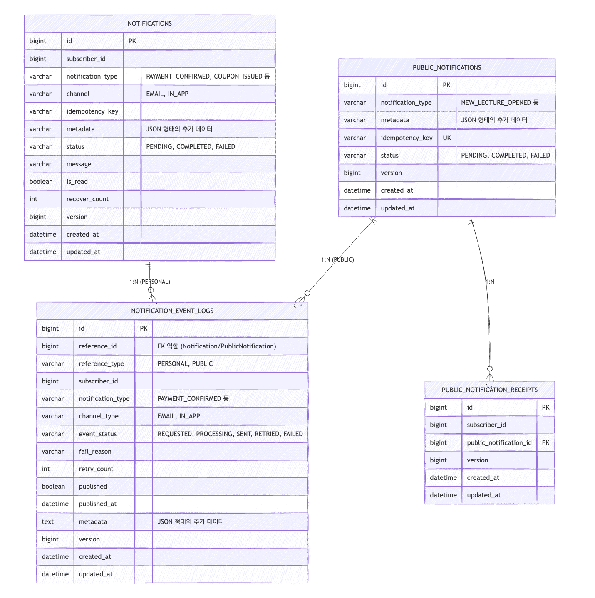

### 예약

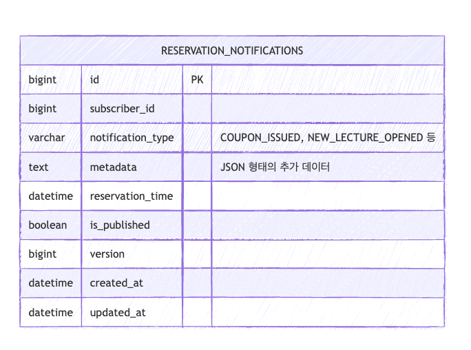

### 알림 메시지 템플릿

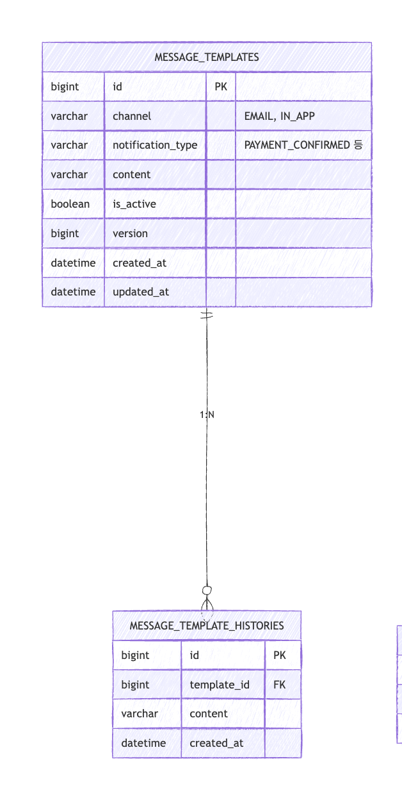

### 유저

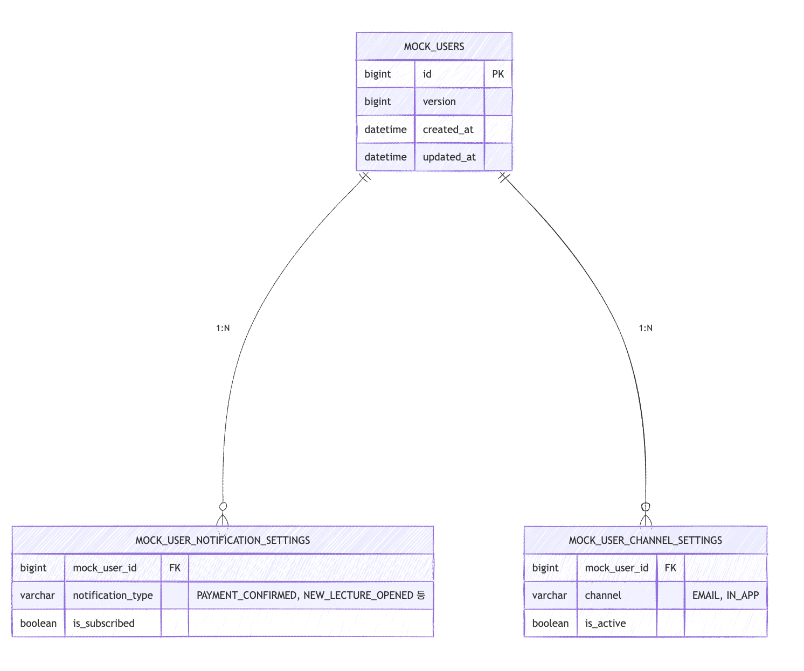

### 공통 알림 DLQ

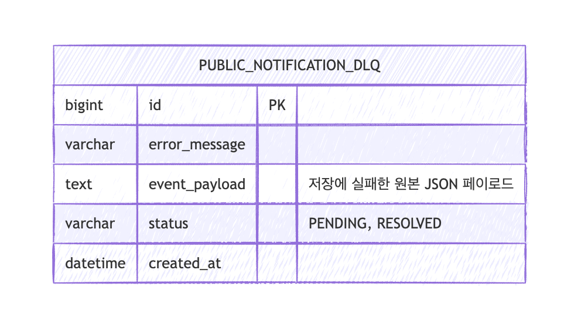

### shed lock

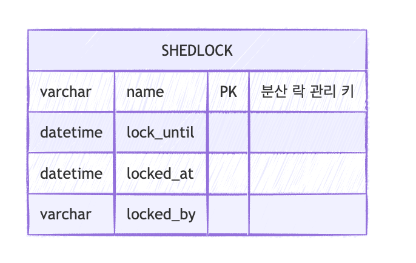

---

## 11. 테스트 실행 방법

```bash
# 전체 테스트 코드 실행
# root 폴더(Notifier)에서 실행
./gradlew clean :app:build --parallel

# 수동 API 테스트
- 프로젝트 내에 포함된 `api.http` 파일을 활용하여 Postman 같은 외부 도구 없이 손쉽게 수동 API 테스트를 진행할 수 있습니다.
- 서버가 실행 중인 상태(`http://localhost:8080`)에서만 정상적으로 응답을 받을 수 있습니다.
```
